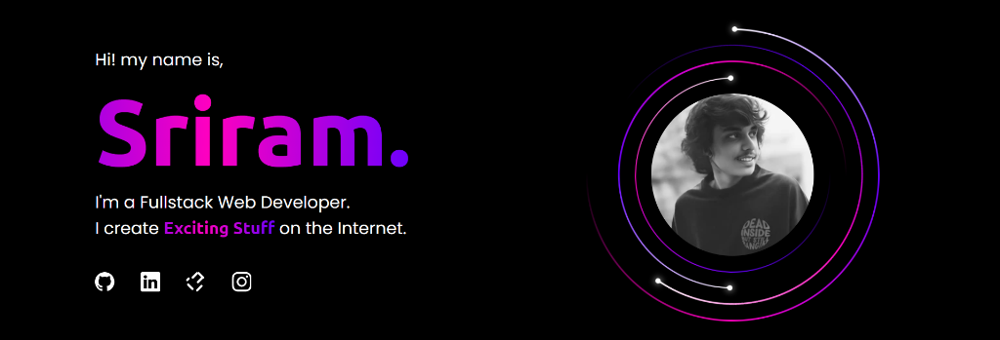

[](https://opensource.org/licenses/MIT)
[](https://github.com/Ram6023)
  
<div align="center">
  
</div>

# Sriram | Fullstack Web Developer

🚀 Welcome to my digital realm! I'm Sriram, a full-stack developer dedicated to building high-performance, visually stunning, and user-centric web applications. This portfolio showcases my journey, skills, and the exciting projects I've built.

## 🌐 Live Demo  
[sriram-portfolio.netlify.app](https://sriram-portfolio.netlify.app/)

## ✨ Features

- **💡 Dynamic Project Routes** - Fully dynamic routing for project pages
- **⚡ Lightning Fast** - Built with Astro for optimized performance and fast load times
- **🎨 Interactive Animations** - Smooth orbital animations powered by GSAP
- **🌙 Dark/Light Theme** - Seamless theme switching with persistent preferences
- **📱 Fully Responsive** - Tailored for all devices using TailwindCSS
- **🔍 SEO Optimized** - Enhanced visibility with meta tags and sitemap
- **📲 PWA Ready** - Installable as a Progressive Web App

## 🏗️ Featured Projects

### [Syslab](https://ram6023.github.io/Syslab/)
An immersive, premium systems engineering laboratory designed to visualize and simulate low-level computing concepts with a futuristic "Command Center" aesthetic.
- **Tech:** Vue 3, TypeScript, Tailwind CSS, @vueuse/motion

### [CareerCompass AI](https://ram6023.github.io/career-compass/)
An AI-powered career intelligence platform providing personalized career insights and strategic planning.
- **Tech:** React, TypeScript, Google AI, Framer Motion

## 🛠️ Tech Stack

<div align="center">
  <a href="https://astro.build/" title="Astro"></a>&emsp;
  <a href="https://preactjs.com/" title="Preact.js"></a>&emsp;
  <a href="https://www.typescriptlang.org/" title="TypeScript"></a>&emsp;
  <a href="https://tailwindcss.com/" title="TailwindCSS"></a>&emsp;
  <a href="https://greensock.com/" title="GSAP"></a>&emsp;
</div>

## 🚀 Quick Start

### Prerequisites
- Node.js 18+ or Bun

### Installation

1. **Clone the repository:**
   ```bash
   git clone https://github.com/Ram6023/portfolio.git
   ```

2. **Navigate to the project:**
   ```bash
   cd portfolio
   ```

3. **Install dependencies:**
   ```bash
   npm install
   # or
   bun install
   ```

4. **Start the development server:**
   ```bash
   npm run dev
   # or
   bun dev
   ```

5. **Open your browser:**
   ```
   http://localhost:4321
   ```

## 📁 Project Structure

```
portfolio/
├── public/          # Static assets (images, fonts, icons)
├── src/
│   ├── assets/      # Project images and SVGs
│   ├── components/  # Astro & Preact components
│   ├── layouts/     # Page layouts
│   ├── pages/       # Route pages
│   └── utils/       # Utility functions and data
├── .github/         # GitHub Actions workflows
└── package.json
```

## 🎨 Customization

To personalize this portfolio for your own use:

1. Update `src/components/Hero.astro` with your name and tagline
2. Modify `src/components/About.astro` with your bio
3. Update social links in `Hero.astro` and `Footer.astro`
4. Replace avatar images in `src/Avatar_*.webp`
5. Update `public/manifest.json` with your details
6. Modify SEO metadata in `src/layouts/Layout.astro`

## 📧 Contact Form Setup

The contact form uses **Web3Forms** for receiving messages. To set it up:

1.  Visit [Web3Forms](https://web3forms.com/) and enter your email to get a free **Access Key**.
2.  Create a `.env` file in the root directory (or rename `.env.example`).
3.  Add your access key:
    ```env
    PUBLIC_WEB3FORMS_ACCESS_KEY=your_access_key_here
    ```
4.  Restart the development server.

Messages sent through the form will now be delivered directly to your email!

## 📦 Build for Production

```bash
npm run build
# or
bun run build
```

The built files will be in the `dist/` directory, ready for deployment.

## 🤝 Connect With Me

<div align="center">
  <a href="https://github.com/Ram6023"></a>&emsp;
  <a href="https://www.linkedin.com/in/sriram-ram6023/"></a>&emsp;
  <a href="https://leetcode.com/u/sriram799/"></a>&emsp;
  <a href="https://www.instagram.com/_.sriramnaidu._?igsh=MXBpNDVtczBuMGFiaA=="></a>&emsp;
</div>

## 📄 License

This project is licensed under the [MIT License](LICENSE).

---

<div align="center">
  <p>Made with ❤️ by <a href="https://github.com/Ram6023">Sriram</a></p>
  <p>⭐ Star this repo if you found it helpful!</p>
</div>
